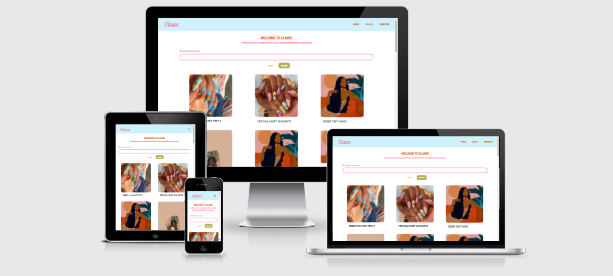

<p><strong>Claws</strong> is a web application for everyone nail art lovers, from the very beginners looking for tips, to experienced tech wanting inspiration for their next set.</p>



<p>Having been borderline obessed with nails art for probably entirely too long, and with Covid starting a boom in self taught nail techs and hobbyists, the Claws applciation is an answer to what myself and many others wanted. A place soley for nail art that doesn't require digging through unwanted posts</p>

<p>With this application users can create and account to share and keep track of their posts, unshare those posts or simply browse what others have shared</p>

[View Claws live here](https://claws-website.herokuapp.com/)
<hr>

### Table of contents
1. [UX](#UX)
     1. [Project Aims](#Project-Aims)
     2. [User Stories](#User-Stories)
     3. [Planning the project](#Planning-The-Project)
2. [Design](#Design)
     1. [Colours](#Colours)
     2. [Fonts](#Fonts)
     3. [Wireframe](#Wireframe)
3. [Database Schema](#Database-Schema)
     1. [Features](#Features) 
     2. [Existing Features](#Existing-Features)
     3. [Future Features](#Future-Features)
4. [Issues and Bugs](#Issues-and-Bugs)
5. [Technologies Used](#Technologies-Used)
     1. [Languages](#Languages)
     2. [Tools](#Tools)
     3. [Libraries](#Libraries)
     4. [Database Management](#Database-Management)
6. [Testing](#Testing) ☞ **[Testing.md](TESTING.md)**
7. [Deployment](#Deployment)
     1. [1. Database Creation](#1-Database-Creation)
     2. [2. Local Copy Creation](#2-Local-Copy-Creation)
     3. [3. Heroku App Creation](#3-Heroku-App-Creation)
8. [Credits](#Credits)
9. [Acknowledgements](#Acknowledgements)
10. [Technical Support](#Technical-Support)
*** 

## UX 
### Project Aims
The main aim of **Claws** is to provide a web-based application, with a minimal, user friendly design, that allows users to create, search, share their sets, tips and talents.

For this project a full-stack website was required that allowed users to manage a common dataset using **HTML5**, **CSS3**, **JavaScript**, **Python**, **Flask** and **MongoDB**.


### User Goals
The user is looking for:
- A database they can search to find nail art posts.
- A user-friendly data management system with **CRUD** conventions to:

    - Create a user account.
    - View their user information.
    - Update (Edit) their user account.
    - Delete their user account.

- An user-friendly dataset management system with **CRUD** conventions to:

    - Create posts.
    - View others posts.
    - Update (Edit) their posts.
    - Delete their posts.

- An simple and easy to naviage interface.

### Developer Goals
The Developer wants to:

- Create a simple and easy to naviage application where the people who enjoy nail art can showcase their work or browse what others have done.
- Demonstrate their newly learned skills utilising in a variety of languages and libraries as well as a document database system.


## User Stories

**As a Non-Registered User, I want to:**

1. Intuitively find posts within the database.
2. View posts registed users created without needing an account
3. Navigate to Register page to start an account.

**As a Registered User, I want to:**

1. Log into my account to gain access to the full functionality of the site.
2. Navigate to my user profile to edit my profile information.
3. View my own post's dashboard to edit if I need to.
4. View my own post's dashboard to delete it if I no longer want it.
5. Navigate to my profile delete my account.
6. Navigate to my profile page to view my uploaded posts.
7. Navigate to an add posts page to upload a new post to the database. 


#### Planning the project 

In order to plan a course of action the users needs must be considered alongside how those needs will be met. 


**Why build the project?**
To create a space where people who share the same interests can: 
    - Search for nail art. 
    - Post nail art or tips.
    - Not have to be registered to view post making the site more inclusive.

**What are the user needs?**
Users will likely want to: 
- To browse 
- To create own posts 
- Edit own posts 
- Delete own posts
- Log In 
- Log Out
- Customise their profile 
- Delete thier profile 
- View posts 
- Save posts 


**How will we address user needs?**

Each users need will have a corresponding page, navigation/and or link to the database. 

- To browse
  - Home page with search bar 
  - Home page doesn't need user to be registered 

- To create own posts 
  - Register page to keep all posts in account 
  - Add posts page 

- Edit own posts 
  - See user posts page
  - Edit posts page 

- Delete own posts
  - Delete posts page via edit posts so functionalities are easy to find

- Log In 
  - Log In page 

- Log Out
  - Log Out page 

- Customise their profile
  - Edit profile page 
  - Profile page to display changes  

- Delete their profile 
    Delete profile page via edit profile so functiionalities are easy to find

- View posts
  - Home page with all posts 
  - User profile with all user posts 
  - Post dashboard to view posts in a bigger format
   
- Save posts (future functionality)
  - Favourites page to keep posts user favourited 
  - Favourites button easily accessed in grid and standalone posts 

## Design

### Colours

The colours for this website were chosen for their bright summery feel. As the design was clean and minimal, bright but well matched colours would prevent it from appearing dull or too 'serious' as it is a creative platform. 


The chosen colours were:

- Flame (#E55019) - 
- Olive Green (#B4AE55) -For buttons
- Light Cyan (#CDF2FB) - Was for backgrounds but used for the navbar
- Tickle Me Pink (#FF7DA1) - For text and outline
- Cadimum Orange (#F38f38) - For buttons 

### Fonts

The fonts were used for this project:

- [Roboto](https://fonts.google.com/specimen/Roboto) - Non title or large text as it is clean and easy to read 

- [Roboto](https://fonts.google.com/specimen/Roboto+Condensed?query=roboto+con) Condensed - For title and large texts as it stands out but still has a nod to Roboto

- [Lobster](https://fonts.google.com/specimen/Lobster?query=lob) - For the Claws logo. Something a bit more fluid to contrast with the other text.


### Wireframe

Some aspects of the design have changed from the wireframe due to styling and time constraints. These are: 

- Home page:
  - No longer exists. It seemed an unneccesary step between the user and the posts 

- Explore page: 
  - Became the home page 

- Individual posts page: 
  - Styling paired back due to time constraints 

- Login and register page: 
  - Styling paired back due to design constraints with responsiveness

 
Inital wireframe can be found [here](static/readme-files/Claws_colours.png)


## Database schema

)


### Collections
- Posts
  - ID - For targeting the post in queries 
  - Image - For post subject/imterest  
  - Post_caption - Users can give information with post image
  - Poster - Links post with the creator (user)

- Users 
  - ID - Allow develpoer and user to modify the database regarding the user holding a specific ID
  - Username - To find the user by 
  - Password - For security. Passord is hashed by Werkzeug 
  - Profile_img - Users can upload and image of their choice
  - Profile_bio - Users can share info about themselves

## Features 
This site allows users to upload, edit and delete posts. Users can customise their account with a profile picture and bio, both of which they can edit. In their profile page users can also delete their account along with all their posts. 

### Existing features 

- Search: 
   - Users can make non case sensitive search based on the title of the post in 

- Log In/Out: 
   - Logs registered users in and out of their sessions returning them to the privileges of unregistered users

- Register: 
   - Creates new user accout and allow them access to registered user functionality 

- Delete proflie: 
   - Deletes user profile and all user posts attached to user

- Create new posts: 
   - User can create a new post by uploading an image then addinga title and caption 

- Edit existing post: 
   - Users can edit their existing posts by changing the title, caption or image or all three

- Delete existing post:
   - Users can delete their posts permanently from their account subesquently the home page 

- Upload profile picture: 
   - Users can customise their profile by uploading an image and writing a bio

- Edit profile: 
   - Users can edit their profile page by uploading a new photo and/ or changing their bio

- Feedback: 
   - Flash messages indicate to user the folowing functionalities are completed or need to be: 
     - Wrong username/password
     - User already exists 
     - Logged in 
     - Logged out 
     - Registered 
     - Post added/edited/deleted
     - Profile edited/deleted


### Future features

- Favourites:
   - So users can save posts the like when so they don't lose them

- Commenting:
   - To make for a mor einteractive site. Users can give other users feedback, edit and delte their own comments

- Chats:
   - Users can keep in contact

- Password change:
   - So users can change their passwords in their accounts for an extra layer of security 

- Password rescue:
   - Email password rescue so users can reset their password if they forget  


## Issues and bugs

**Masonary layout**
I used a css masonry layout that is supported by Boostrap 5 with the help of the Masonry plugin. Occasionally on load, the cards will overlap. A quick refresh solves it, but it is worth noting. 


## Technologies Used
### Languages
- [HTML5](https://en.wikipedia.org/wiki/HTML5 "Link to HTML Wiki")
- [CSS3](https://en.wikipedia.org/wiki/Cascading_Style_Sheets "Link to CSS Wiki")
- [JavaScript](https://en.wikipedia.org/wiki/JavaScript "Link to JavaScript Wiki")
- [Python](https://www.python.org/ "Link to Python Homepage")

### Tools
- [Visual Studio Code Insiders](https://www.gitpod.io/docs "Link to download Visual Studio Code Insiders") 
     - Used Gitpod which uses the VSCode IDE
- [GitHub](https://github.com/ "Link to GitHub")
     - GitHub stored the project repository
- [Git](https://git-scm.com/ "Link to Git homepage")
     - Git used for version to commit to Github push project to Heroku
- [Heroku](https://id.heroku.com/login "Link to Heroku login page")
     -  Heroku used to deploy the website
- [Figma](https://www.figma.com/ "Link to Figma homepage")
     - Figma used to create wireframes
- [Am I Responsive?](http://ami.responsivedesign.is/# "Link to Am I Responsive Homepage")
     - Am I Responsive used to validate responsiveness and multi screen mock up
- [Font Awesome](https://fontawesome.com/ "Link to Font Awesome site")
     - Font Awesome was used for website icons


### Libraries
- [Bootstrap](https://getbootstrap.com/docs/4.4/getting-started/introduction/ "Link to Bootstrap page")
     - Bootstrap used for ease of responsive design
- [jQuery](https://jquery.com/ "Link to jQuery page")
     - jQuery used to simplify the JavaScript code used.
- [Google Fonts](https://fonts.google.com/ "Link to Google Fonts")
    - Google fonts was used to import the fonts **"Indie Flower"** and **"Work Sans"** into the style.css file. These fonts were used throughout the project.
- [Flask](https://flask.palletsprojects.com/en/2.0.x/ "Link to Flask Homepage")
     - Flask used as the web framework for the application.
- [PyMongo](https://pypi.org/project/pymongo/ "Link to PyMongo information")
     - `flask_pymongo` used to let the MongoDB database and Python talk to one another.
- [BSON](https://bsonspec.org/ "Link to BSon documentation")
     - `bson.objectid` is a required dependency for MongoDB management system.
- [Jinja](http://jinja.pocoo.org/docs/2.10/ "Link to Jinja information")
     - Jinja templating language used display in and pass backend data to html.
- [Werkzeug](https://werkzeug.palletsprojects.com/en/2.0.x/ "Link to Werkzeug information")
     - Werkzeug was used for password hashing and authentication.
- [Cloudinary](https://cloudinary.com/ "Link to cloudinary information")
     - Used for image uploading

### Database Management
- [MongoDB](https://www.mongodb.com/ "Link to MongoDB site")
     - MongoDB was the NoSQL database for this website.
- [MongoDB Atlas](https://www.mongodb.com/cloud/atlas "Link to MongoDB Atlas site")
     - MongoDB Atlas was the cloud database service used to host the database.


[Back to top ⇧](#table-of-contents)

## Testing

Testing information can be found in a separate testing [file](TESTING.md "Link to testing file")

## Deployment
A clone of this project can be made using the following:
### 1. Database Creation
To start, application is connected to a [MongoDB Atlas](https://mongodb.com/ "Link to MongoDB Homeapage") Cluster. Then to create a project database:

1. Log into [MongoDB](https://account.mongodb.com/account/login "Link to MongoDB login page") or [create an account](https://account.mongodb.com/account/register "Link to MongoDB sign-up page").
2. Find and select the `New Project` button on the right side of the page, and give your project a name. Navigate to the project page.
3. Find and select the `Create a New Cluster` button on the right hand side of the page. Once selected:
     - Choose **Shared Cluster** free option.
     - Select your **Cloud Provider** and **Region** (here, choose: **AWS** and **Ireland**).
     - Click on **Cluster Tier** and select tier of preference (in this instance: **Basic M0 tier**).
     - Click on **Cluster Name** and create your cluster name.
4. Find and select `Database Access` on the left side of the page. Once selected, click `Add New Database User`:
     - Choose `Password` for the **Authentication Method**
     - Enter a username and password of your choosing
     - Ensure `Read and write to any database` is selected in **Database User Privileges**
     - Add User
5. Locate and select `Network Access` under `Database Access` on the left side of the page. Once selected, click `Add IP Address`:
     - Select `Allow Access from anywhere` (Not recommended for full-production applications).
     - Select `Confirm`.
6.Find and select `Clusters` on the left hand side of the page (must be provisioned first).
7. Click `Collections`, then `+ Create Database` to start adding documents to your database collections:
     - Enter chosen `Database Name`
     - Enter chosen `Collection Name`
     - Select `Create`
8. Click `Create Collection` and create the necessary collections. See [Data Schema](#Data-Schema) for reference of the collections created for this project.

### 2. Local Copy Creation
A Local Clone of the repository can be made in two ways:

- **Forking the Repository:**

     By forking the GitHub Repository we make a copy of the original repository on our GitHub account to view and/or make changes without affecting the original repository by using the following steps:

     1. Log into [GitHub](https://github.com/login "Link to GitHub login page") or [create an account](https://github.com/join "Link to GitHub create account page").
     2. Locate the [GitHub Repository](https://github.com/rebeccatraceyt/bake-it-til-you-make-it "Link to GitHub Repo").
     3. At the top of the repository, on the right side of the page, select "Fork".
     4. This should give you a copy of the original repository in your GitHub account.

-  **Creating a Clone**

     How to run this project locally:
     1. Install the [GitPod Browser](https://www.gitpod.io/docs/browser-extension/ "Link to Gitpod Browser extension download") Extension for Chrome.
     2. After installation, restart the browser.
     3. Log into [GitHub](https://github.com/login "Link to GitHub login page") or [create an account](https://github.com/join "Link to GitHub create account page").
     2. Locate the [GitHub Repository](https://github.com/rebeccatraceyt/bake-it-til-you-make-it "Link to GitHub Repo").
     5. Click the green "GitPod" button in the top right corner of the repository.
     This will trigger a new gitPod workspace to be created from the code in github where you can work locally.

     How to run this project within a local IDE, such as VSCode:

     1. Log into [GitHub](https://github.com/login "Link to GitHub login page") or [create an account](https://github.com/join "Link to GitHub create account page").
     2. Locate the [GitHub Repository](https://github.com/rebeccatraceyt/bake-it-til-you-make-it "Link to GitHub Repo").
     3. Under the repository name, click "Clone or download".
     4. In the Clone with HTTPs section, copy the clone URL for the repository.
     5. In your local IDE open the terminal.
     6. Change the current working directory to the location where you want the cloned directory to be made.
     7. Type 'git clone', and then paste the URL you copied in Step 3.
     ```
     git clone https://github.com/USERNAME/REPOSITORY
     ```
     8. Press Enter. Your local clone will be created.

     (Further reading and troubleshooting on cloning a repository from GitHub [here](https://docs.github.com/en/free-pro-team@latest/github/creating-cloning-and-archiving-repositories/cloning-a-repository "Link to GitHub troubleshooting"))

Once a local clone is created, the environment variables have to be set:

1. Create a `.gitignore` file in the project's root directory.
2. In the terminal window, type `touch env.py` to create the file that will contain the environment variables. 
3. Add `env.py` to the `.gitignore` file.
4. Within the `env.py` file, enter the project's environment variables:
```
import os

os.environ.setdefault("IP", "0.0.0.0")
os.environ.setdefault("PORT", "5000")
os.environ.setdefault("SECRET_KEY", <your_secret_key>)
os.environ.setdefault("MONGO_URI", "mongodb+srv://<username>:<password>@<cluster_name>-ocous.mongodb.net/<database_name>?retryWrites=true&w=majority" )
os.environ.setdefault("MONGO_DBNAME", <your_mongo_db_name>)
```
For the `MONGO_URI` remember to replace `<username>`, `<password>`, `<cluster_name>` and `<database_name>` with the correct values or it may not work.


### 3. Heroku App Creation
The website requires back-end technology, including a server, application and database. It is because of this that the project was deployed on **Heroku**, a container-based cloud Platform as a Service. There are two ways to deploy on Heroku:

- Using the Heroku Command Line Interface
- Connect to GitHub Repository (This method is preferable)

Before you can deploy to Heroku:

1. Create a `requirements.txt` file to install all requirements. In the terminal window, type the following command:
```
pip3 install -r requirements.txt
```
2. Create a `Procfile` file so that Heroku knows which file runs the app. In the terminal window, type the following command:
```
echo web: python app.py > Procfile
```
*Remove the blank line that may occur at the end of the Procfile to avoid any issues*


3. Push the two files to the repository:
```
git add requirements.txt
git commit -m "Add requirements.txt"

git add Procfile 
git commit -m "Add Procfile"

git push
```
After that, to deploy to heroku:

1. Log into [Heroku](https://id.heroku.com/login "Link to Heroku login page") or [create an account](https://signup.heroku.com/login "Link to Heroku sign-up page").
2. Select the `New` button on the top-right of the page, and choose `Create New App`. Give your app a unique name and set the region (in this instance: **Europe**). Then click `Create App`.
3. Navigate to the `Deploy` tab on the dashboard and select `Connect to GitHub`.
4. Search for the repository name (ensuring it is spelled correctly). Once located, click `Connect`. 
5. Navigate to the `Setting` tab on the dashboard and select `Reveal Config Vars`, entering the necessary key/values as below:

| Key | Value |
 --- | ---
IP | 0.0.0.0
PORT | 5000
SECRET_KEY | `<your_secret_key>`
MONGO_URI | `mongodb+srv://<username>:<password>@<cluster_name>-ocous.mongodb.net/<database_name>?retryWrites=true&w=majority`
MONGO_DBNAME | `<your_mongo_db_name>`

6. Navigate back to the `Deploy` tab and scroll down to `Automatic Deploys`.
7. Ensure that the `master` branch is selected, then select `Enable Automatic Deploys`.

Heroku will receive the pushed code from the GitHub repository and host the application with the required packages set out. 

The deployed version can now be viewed by selecting `View App` in the top-right of the page.


[Back to top ⇧](#table-of-contents)

## Credits 
The developer consulted multiple sites in order to better understand the code they needed to implement their deisgn. 

The [Code Institute Task Manager Mini Project](https://github.com/Code-Institute-Solutions/TaskManagerAuth) mini project was a reference point for developing the core **CRUD** functionality of the website and how those components could be customised to suit the project

Copied and edited edited code is refeenced within the code, but these site were used to understand issues, brush up on prior knowledge and to learn other ways to approach aspects of the project:
- [Stack Overflow](https://stackoverflow.com/ "Link to Stack Overflow page")
- [W3Schools](https://www.w3schools.com/ "Link to W3Schools page")
- [Bootstrap](https://getbootstrap.com/ "Link to BootStrap page")

[Back to top ⇧](#table-of-contents)

## Acknowledgements
A huge thanks to the following:
- Fellow CI students, especially Sean Young who helped several times at ungodly hours.
- Anouska Anastasia for allow me to use her stunning nail art you can find [here](https://www.instagram.com/anouskaanastasia/ "Link to Anouska's ig page")
- My family especially my sisters who are absolute babes for staying up with me so I'm not studying alone.
- Student and tutor support for always being so understanding and helpful. 

[Back to top ⇧](#table-of-contents)

***
